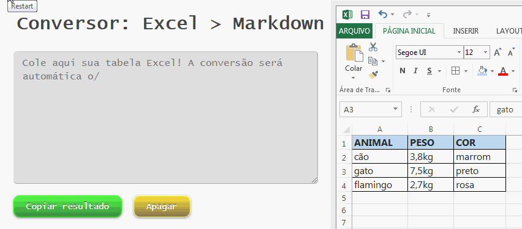

# Copy Excel Paste Markdown

fork do projeto "Copy-Excel-Paste-Markdown" com incrementos no código e tradução em PT-BR. Acesse o link abaixo para fazer a operação:<br>
https://cuelholima.github.io/copiar-excel-colar-md/

## Como funciona?

Copie uma tabela do Excel (ou outro programa de planilha similar) e cole no campo digitável. O resultado será automático.



## Alinhamento de colunas

Opcionalmente, você pode pré-especificar um alinhamento de coluna. Basta colocar uma das sequências de caracteres nos nomes de cabeçalho da coluna:

* ^c  - alinhamento no centro
* ^r  - alinhamento à direita
* ^l  - alinhamento à esquerda (padrão)

Exemplo prático: Insira ^r no cabeçalho PESO para alinhar à direita. Insira ^c no cabeçalho cor para alinhar ao centro, como é mostrado abaixo.

| ANIMAL    | ^rPESO   | ^cCOR    |
|-----------|----------|----------|
| cão       | 3,8kg    | marrom   |
| gato      | 7,5kg    | preto    |
| flamingo  | 2,7kg    | rosa     |

Isso irá produzir o seguinte resultado em markdown:

```markdown
| ANIMAL    | PESO   | COR     |
|-----------|-------:|:-------:|
| cão       | 3,8kg  | marrom  |
| gato      | 7,5kg  | preto   |
| flamingo  | 2,7kg  | rosa    |
```
